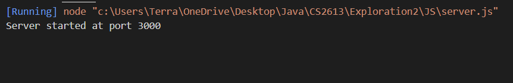
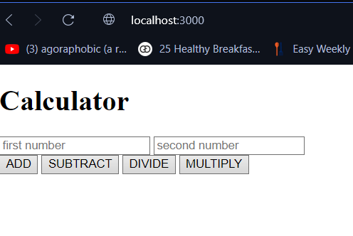
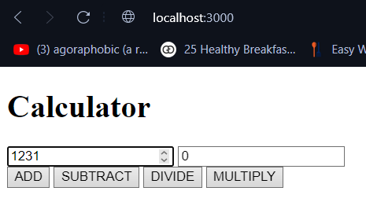
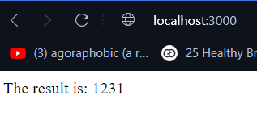
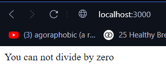

[](https://classroom.github.com/a/kCrKdl4V)

# Which package/library does the sample program demonstrate?
While I was thinking about working on the same library (or to improve) my first exploration activity. I have decided to work on Express.js for JavaScript. The reason for this switch was to learn something that I had little experince with.

# How does someone run your program?

This program works with express.js to work as webapp. Since express.js is design to work as webapp, all we have to do to install the package probably and run the code.

To install the packgace, we follow the same method as we always do on JS which will be given in the overview page as well:

```
npm install express
```

1) Now that we have the package installed, next step would be to install the files from this GitHub.

2) Keeping all of the files on the same folder, we require to cd to the folder in the terminal (You can do this on VScode which does not require the terminal and you can just click the run button) 

3) Start the express server via the "node server" command in the terminal.

4) After making sure that our server.js is running properly (Which will log the sentence "Server started at port " with the port that is running on in the end of the sentence.), next steps is to start a local server on your browser by searching "localhost:3000" (This is 3000 for me because while I was testing the code, I have set the port to this. You can change the port in server.js file.). 

With our local host open, we can use this simple calculator as much as we want. One thing to note is that, to reuse the calculator function all you have to do is to go back a page on your browser.

Before closing your terminal (or VScode) make sure to stop server.js by clicking "ctrl + c" on the terminal.


# What purpose does your program serve? 

My code has the most basic function of a calculator where you can input 2 numbers and choice an operation from 4 options of "Add", "Subtract", "Divide", and "Multiply".

# What would be some sample input/output?

Let's look at some examples. First thing first, what does the message logged and our local host will look like.

 

Now, let's see how will it look like after putting in values and once more after choosing an operation:

This code uses html file to create the webapp which has been set so that user can only input int.


Let's try the add operator for this example which should give us 1231 since our second value is 0. The reason I picked 0 as my second value, I want to show that trying to divide with 0 will give a different message and won't be doing the operation itself:

 